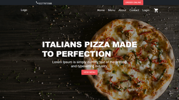

# Application Name

Coffe shop

## Description

This is a React application styled with Tailwind CSS. The server is a custom implementation.

## Installation

1. Clone the repository to your local machine.
2. Navigate to the project directory in your terminal.
3. Run the following command to install the necessary dependencies: `npm install`

## Getting Started

1. To start the client-side of the application, run:
   `npm start`

2. To start the server, run: `npm run start-server`
